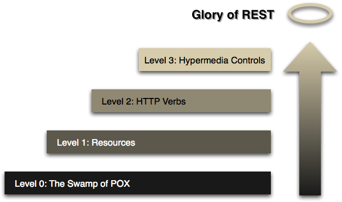

# Spring HATEOAS

## REST API란?

분산 하이퍼미디어 시스템(ex 웹)을 위한 아키텍쳐 스타일. 예를 들어, 네이버에서 블로그에 글을 저장하거나, 글 목록을 읽어갈 수 있도록 외부에 기능을 제공하거나 우체국에서 우편번호를 조회할 수 있는 기능을 제공하거나, 구글에서 구글 지도를 사용할 수 있도록 제공하는 것들을 말한다. 웹을 구성하는 것들은 아래와 같다. 

* Client - Server
* Stateless
* Cache
* Uniform Interface
* Layered System
* Code-On-Demand(optional) : 서버에서 클라이언트로 코드를 보내면 실행할수 있어야됨(ex JS)

### Uniform Interface의 제약조건

* Identification of resource : Resource가 URI로 식별되어야 된다. (samsung/sds/59th...)
* Manipulation of resource through representations : representation 전송을 통해 resource 조작 (GET, POST, PUT, DELETE,PATCH)
* **self-description message**
* **hypermedia as the engine of application state(HATEOAS)**

대부분의 REST API들이 이를 지키지 못하고 있음..

### Self-descriptive message

메시지만 봐도, 무슨 뜻인지 알아야한다.

```
HTTP/1.1 200 OK
Content-Type: application/json-patch+json

[ { "op": "remove", "path": "/a/b/c" } ]
```

RESTful API로 통신할 때, 수정을 위해서는 주로 PUT 방식으로 request를 날릴 것이다. 다만 좀 세부적으로 들어가면, 전체를 날려서 수정하는 것은 PUT 통신, 일부(partial)를 날려서 수정하는 것은 [PATCH 통신](https://developer.mozilla.org/ko/docs/Web/HTTP/Methods/PATCH)을 이용하는 것이 올바른 방식이다.

### HATEOAS

애플리케이션의 상태는 Hyperlink를 이용해 전이되어야한다. (페이지 변경 등) (Anchor Tag 가 대표적)

```
HTTP/1.1 200 OK
Content-Type: application/json
{
    “Title” : “The second article”,
    “content” : “Hello! Brother"
    _link :
    {
        previous : /article/1
        next : article/3
    }
}
```

### Uniform Interface가 필요한 이유?

서버와 클라이언트가 각각 독립적으로 진화하면, 서버의 기능이 변경되어도 클라이언트를 업데이트할 필요가 없게 하기 위해(클라이언트랑 서버랑 통테를 줄이고, 각자도생을 하면서 윈윈하자!)

## Spring HATEOAS

HATEOAS를 사용하는 이유는 다음과 같은 REST API의 단점을 보완하기 위해

1. End Point URL 변경 제한.\
   엔드 포인트 URL을 변경하면 모든 클라이언트의 URL 역시 변경해야 합니다.
2. 자원의 상태를 고려하지 않음.\
   전달받은 정적 자원의 상태에 따른 로직이 클라이언트에서 처리되어야 함.

위 단점들을 LINK에 사용 가능한 URL을 리소스로 전달하여 클라이언트가 참고하여 사용 할 수 있도록 하여 극복\
이러한 링크정보를 JSON으로 표현한 사실상의 표준이 있는데, 바로 `HAL(Hpyertext Application Language)`이며 컨텐트 타입은 application/hal+json\
HAL을 사용하면 REST 자원을 표시하기 위한 자료 구조를 그때그때 따로 만들지 않아도 HATEOAS를 구현 할 수있다.\





1. 요청 URI가 변경되더라도 클라이언트에서 동적으로 생성된 URI를 사용함으로써, 클라이언트가 URI 수정에 따른 코드를 변경하지 않아도 되는 편리함을 제공
2. URI 정보를 통해 들어오는 요청을 예측 가능 (가용포인트 100P -> 포인트를 사용할수 있는 api \_link / 0P )
3. Resource가 포함된 URI를 보여주기 때문에, Resource에 대한 확신

## pom.xml

```markup
<?xml version="1.0" encoding="UTF-8"?>
<project xmlns="http://maven.apache.org/POM/4.0.0" xmlns:xsi="http://www.w3.org/2001/XMLSchema-instance"
         xsi:schemaLocation="http://maven.apache.org/POM/4.0.0 https://maven.apache.org/xsd/maven-4.0.0.xsd">
    <modelVersion>4.0.0</modelVersion>
    <parent>
        <groupId>org.springframework.boot</groupId>
        <artifactId>spring-boot-starter-parent</artifactId>
        <version>2.5.1</version>
        <relativePath/> <!-- lookup parent from repository -->
    </parent>
    <groupId>com.rumblekat</groupId>
    <artifactId>SpringBootHateos</artifactId>
    <version>0.0.1-SNAPSHOT</version>
    <name>SpringBootHateos</name>
    <description>Demo project for Spring Boot</description>
    <properties>
        <java.version>11</java.version>
    </properties>
    <dependencies>
        <dependency>
            <groupId>org.springframework.boot</groupId>
            <artifactId>spring-boot-starter-hateoas</artifactId>
        </dependency>

        <dependency>
            <groupId>org.springframework.boot</groupId>
            <artifactId>spring-boot-starter-test</artifactId>
            <scope>test</scope>
        </dependency>

    </dependencies>

    <build>
        <plugins>
            <plugin>
                <groupId>org.springframework.boot</groupId>
                <artifactId>spring-boot-maven-plugin</artifactId>
            </plugin>
        </plugins>
    </build>

</project>

```

## Directory 구


## GreetingController

```java
package com.rumblekat.springboothateos.controller;

import com.rumblekat.springboothateos.domain.Greeting;
import org.springframework.http.HttpEntity;
import org.springframework.http.HttpStatus;
import org.springframework.http.ResponseEntity;
import org.springframework.web.bind.annotation.RequestMapping;
import org.springframework.web.bind.annotation.RequestParam;
import org.springframework.web.bind.annotation.RestController;

import static org.springframework.hateoas.server.mvc.WebMvcLinkBuilder.*;

@RestController
public class GreetingController {
    private static final String TEMPLATE = "Hello, %s!";

    @RequestMapping("/greeting")
    public HttpEntity<Greeting> greeting(@RequestParam(value = "name", defaultValue = "World") String name){
        Greeting greeting = new Greeting(String.format(TEMPLATE,name));
        greeting.add(linkTo(methodOn(GreetingController.class).greeting(name)).withSelfRel());
        return new ResponseEntity<>(greeting, HttpStatus.OK);
    }

}

```

## Greeting

```java
package com.rumblekat.springboothateos.domain;

import com.fasterxml.jackson.annotation.JsonCreator;
import com.fasterxml.jackson.annotation.JsonProperty;
import org.springframework.hateoas.RepresentationModel;

public class Greeting extends RepresentationModel<Greeting> {
    private final String content;

    @JsonCreator
    public Greeting(@JsonProperty("content") String content){
        this.content = content;
    }

    public String getContent(){
        return this.content;
    }
}

```

## Greeting Test

```java
package com.rumblekat.springboothateos.controller;

import org.junit.jupiter.api.Test;
import org.springframework.beans.factory.annotation.Autowired;
import org.springframework.boot.test.autoconfigure.web.servlet.AutoConfigureMockMvc;
import org.springframework.boot.test.context.SpringBootTest;
import org.springframework.test.web.servlet.MockMvc;
import org.springframework.test.web.servlet.result.MockMvcResultMatchers;

import static org.springframework.test.web.servlet.request.MockMvcRequestBuilders.get;
import static org.springframework.test.web.servlet.result.MockMvcResultHandlers.print;
import static org.springframework.test.web.servlet.result.MockMvcResultMatchers.status;

@SpringBootTest
@AutoConfigureMockMvc
class GreetingControllerTest {

    @Autowired
    MockMvc mockMvc;

    @Test
    public void 기본_HATEOS_테스트() throws Exception {

        final String ans ="Hello, World!";

        mockMvc.perform(get("/greeting"))
                .andExpect(status().isOk())
                .andDo(print())
                .andExpect(MockMvcResultMatchers.jsonPath("$.content").value(ans));
    }

    @Test
    public void PARAM_추가_HATEOS_테스트() throws Exception {

        final String ans ="Hello, Rumblekat!";
        final String param = "Rumblekat";

        mockMvc.perform(get("/greeting").param("name",param))
                .andExpect(status().isOk())
                .andDo(print())
                .andExpect(MockMvcResultMatchers.jsonPath("$.content").value(ans));
    }

}
```


[https://brunch.co.kr/@purpledev/29](https://brunch.co.kr/@purpledev/29) -- 카카오 헤어샵 HATEOAS 적용 예

[https://chaibin0.tistory.com/entry/Spring-HATEOAS-%EC%A0%81%EC%9A%A9](https://chaibin0.tistory.com/entry/Spring-HATEOAS-%EC%A0%81%EC%9A%A9)
